# InvestHome

**Single-user, self-hosted personal finance dashboard for homelab use.**

InvestHome is a Flask + SQLite finance tracker designed for people who want to own their data, run the app locally, and track a full household/personal finance picture without using a hosted SaaS platform.

Current release candidate:

```text
v3.0.0-rc.1
```

> Built as a pragmatic self-hosted finance tracker first. This is not financial advice, and you should verify calculations before making real financial decisions from them.

---

## Screenshots

### Dashboard

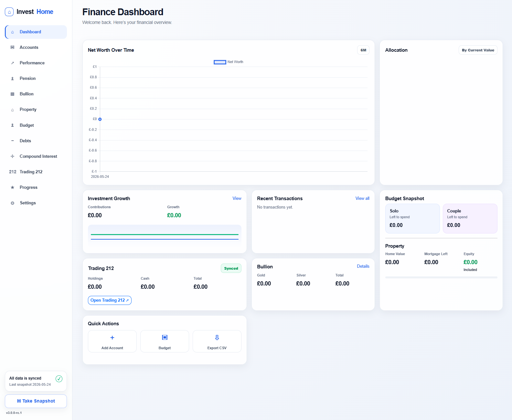

### Core tracking pages

| Accounts | Performance |
|---|---|
| 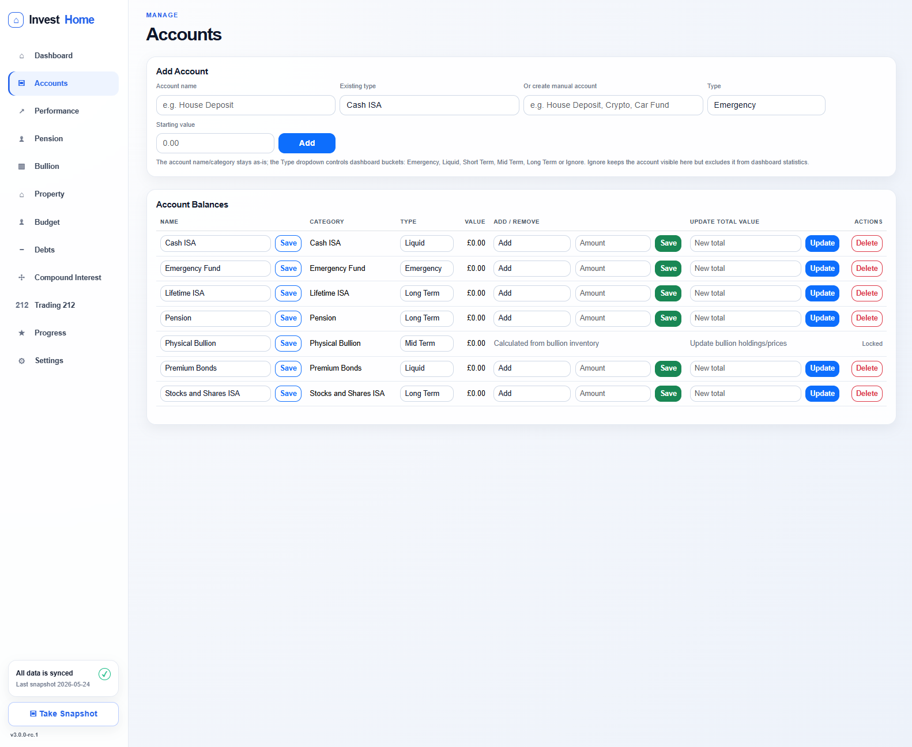 | 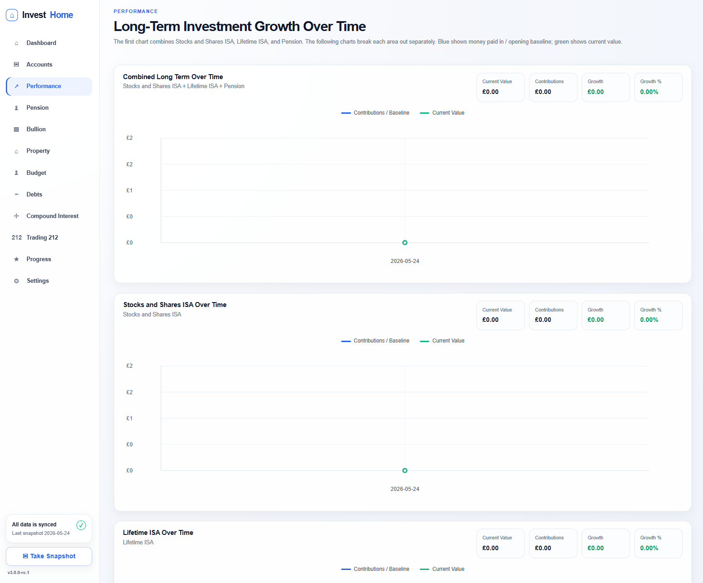 |

| Pension | Bullion |
|---|---|
| 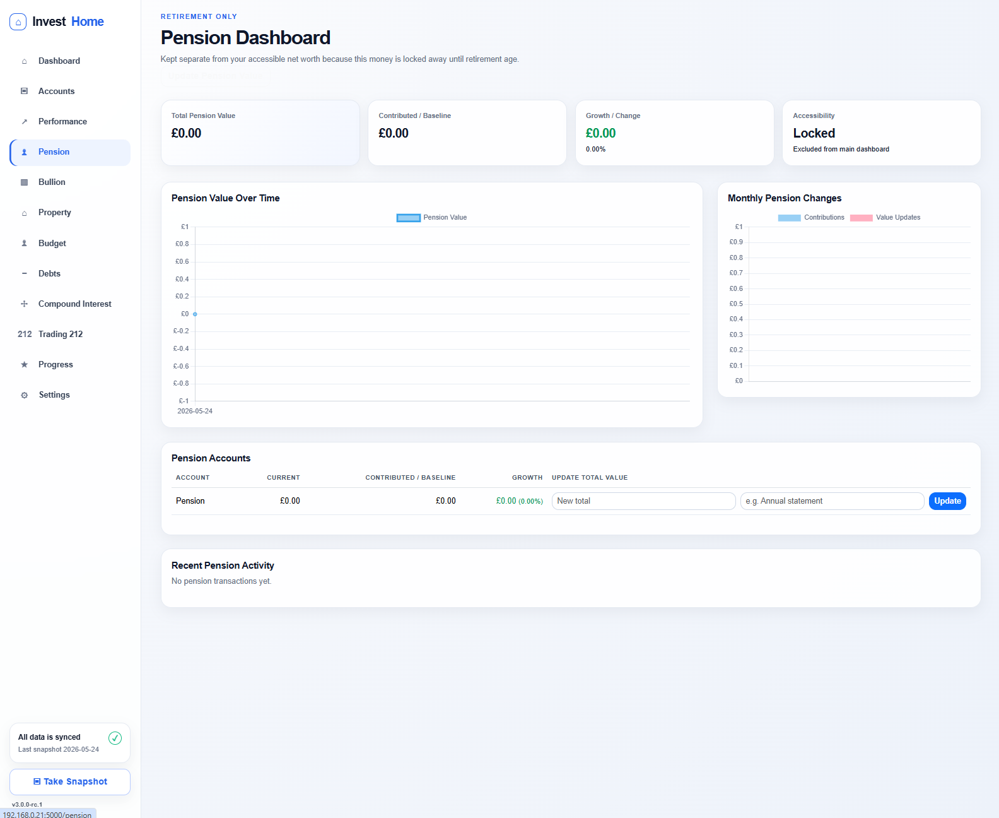 | 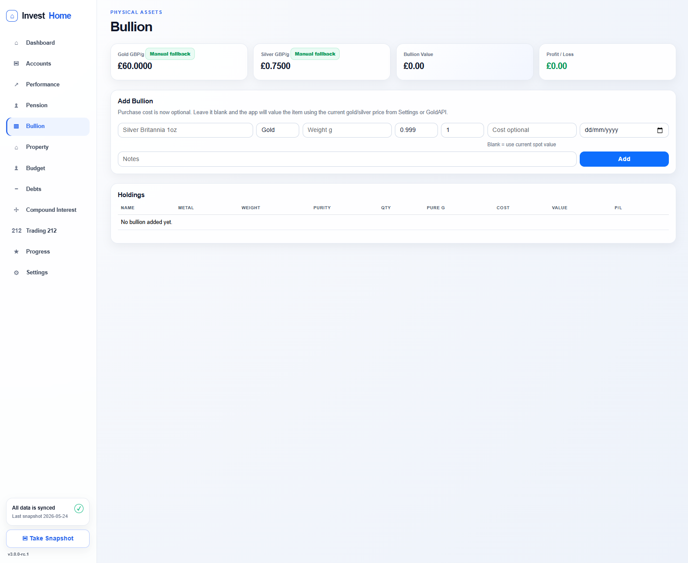 |

| Property | Budget |
|---|---|
| 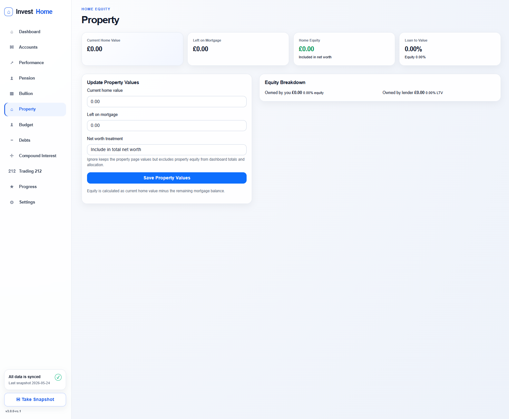 | 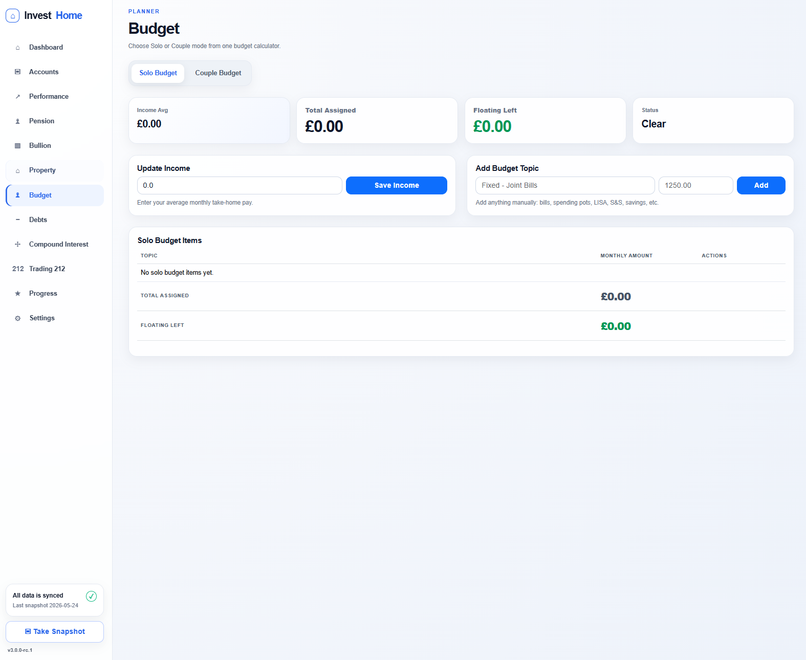 |

| Debts | Compound Interest |
|---|---|
| 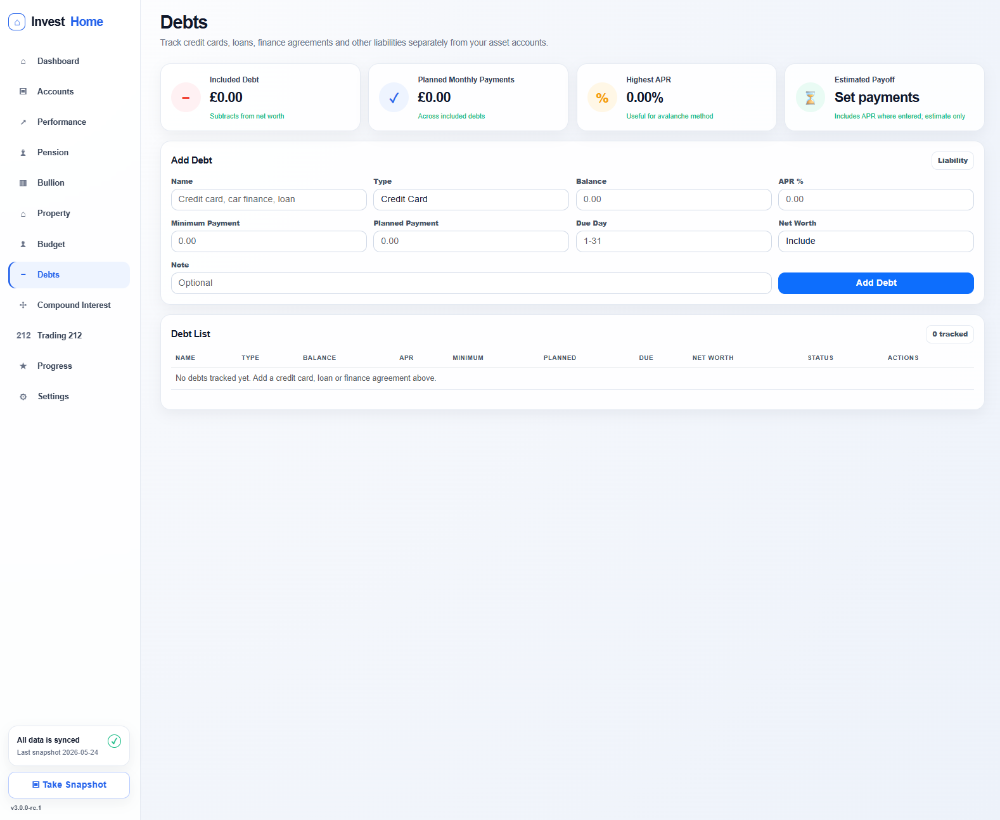 | 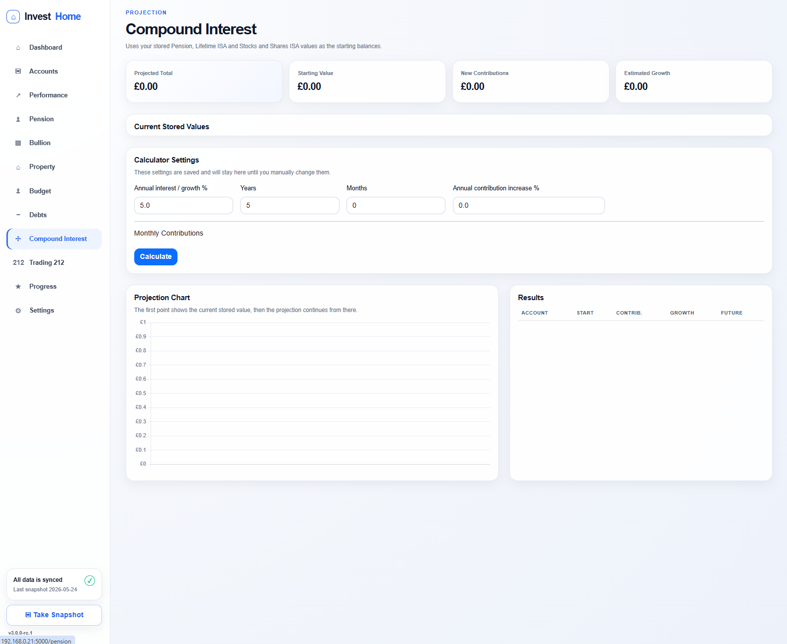 |

| Trading 212 | Progress |
|---|---|
| 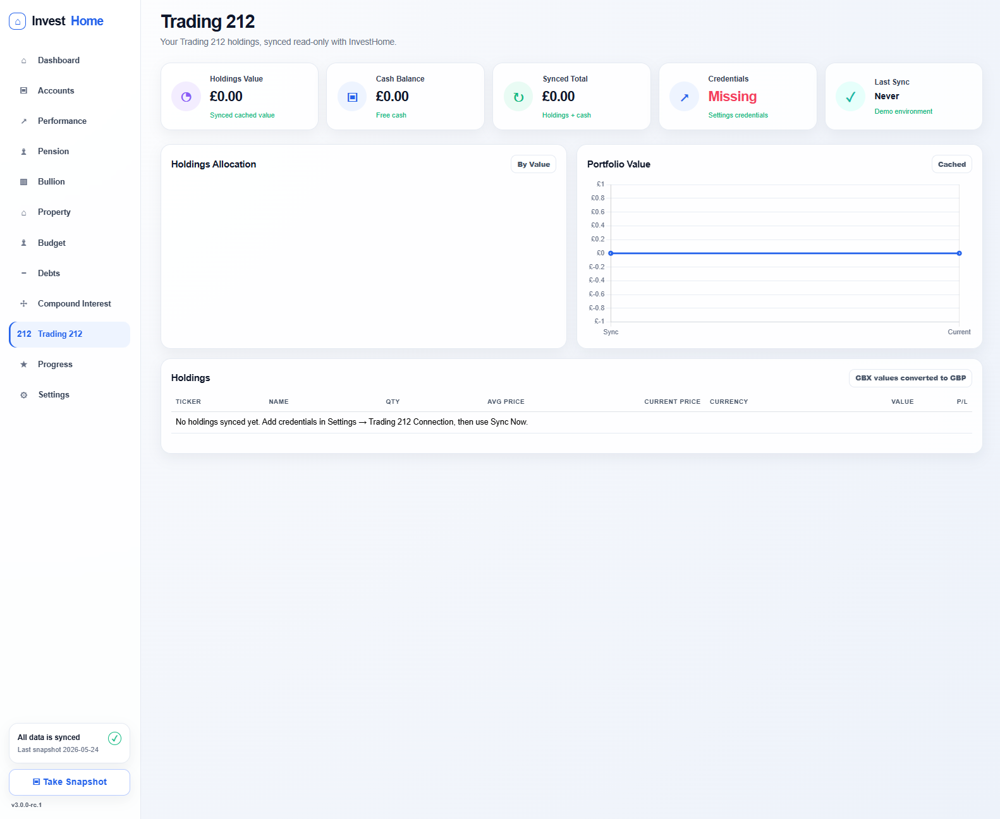 | 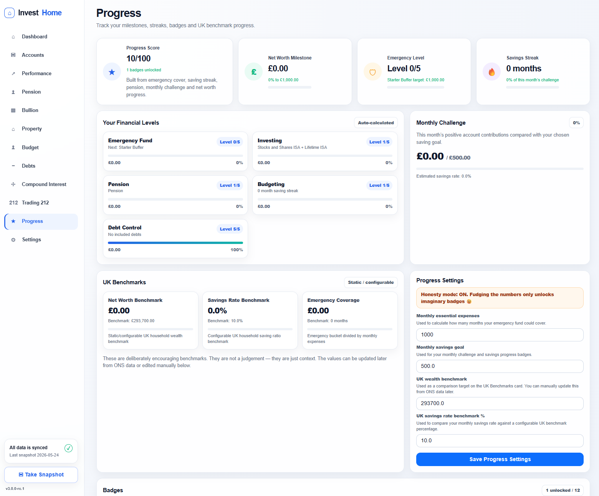 |

### Settings and database tools

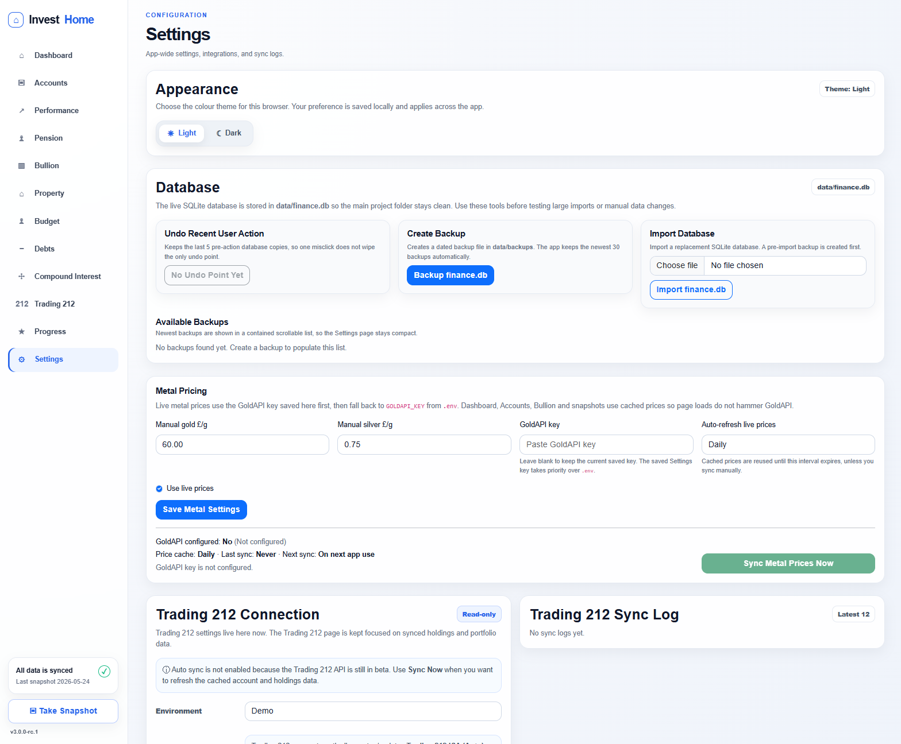

---

## What InvestHome tracks

- **Net worth dashboard** across cash, investments, pension, property equity, bullion and debts.
- **Account balances** with bucket types such as Emergency, Short Term, Mid Term, Long Term and Ignore.
- **Transactions and snapshots** so changes over time can be charted.
- **Investment performance** with contribution-aware growth calculations.
- **Pension tracking** as a separate long-term view.
- **Physical bullion** with optional GoldAPI-powered live gold/silver pricing.
- **Property value, mortgage remaining and equity**, with an option to include or ignore property in net worth.
- **Solo and couple budgeting** with assigned/floating totals.
- **Debt/liability tracking** for credit cards, loans, car finance, overdrafts, BNPL and other finance agreements.
- **Compound interest projections** for pension, LISA and Stocks & Shares ISA style goals.
- **Trading 212 read-only sync**, creating an auto-managed account balance row.
- **Progress/gamification page** with milestones, savings streaks, badges and configurable UK benchmark values.
- **Database tools** for backup, restore, import and undo points.

---

## v3.0.0 release candidate highlights

The v3 work was a backend refactor and long-term hardening pass. The frontend is intentionally mostly unchanged from the late v2 builds.

### Backend refactor

- Added `config.py` for app constants, paths and provider defaults.
- Added `db.py` for SQLite setup, migrations, indexes and shared DB helpers.
- Added `utils.py` for shared small helpers such as safe numeric parsing.
- Extracted backup/database safety logic into `services/backups.py`.
- Extracted Trading 212 logic into `services/trading212.py`.
- Extracted performance chart/calculation logic into `services/performance.py`.
- Extracted debt payoff/domain logic into `services/debts.py`.
- Added Flask blueprints under `routes/` for Settings, Debts, Progress, Accounts, Budget, Property and Trading 212.
- Added lightweight `pytest` smoke tests to protect future refactors.

### Data safety and database tools

- Runtime database lives in `data/finance.db`, not the project root.
- Existing legacy root `finance.db` can be migrated automatically.
- Settings page includes backup, restore, import and undo tools.
- Backup list is scrollable and capped by retention policy.
- Undo points use a small timestamped ring buffer instead of a single overwritten file.
- SQLite indexes were added for transaction and snapshot hot paths.

### API integrations

- **GoldAPI** key can be managed from Settings → Metal Pricing.
- `.env` `GOLDAPI_KEY` remains as a fallback.
- GoldAPI prices are cached to reduce API calls and avoid rate limiting.
- Manual metal-price sync is available from Settings.
- Trading 212 remains manual-sync because the Trading 212 API is still in beta.
- Trading 212 creates/updates `Trading 212 ISA (Auto)` as a read-only provider-managed account.

### Finance logic improvements

- Lifetime ISA contributions no longer automatically add the 25% bonus immediately; the bonus is only reflected once it actually appears in the account value.
- Trading 212 values are reconciled consistently across Account Balances, Dashboard and Compound Interest.
- Debt payoff estimate now uses APR-aware amortisation and flags payments that are too low to reduce the balance.
- Account bucket cards show which account names make up each dashboard total.
- Type `Ignore` can exclude accounts from dashboard/statistics while keeping them visible.

---

## Project structure

```text
investhome/
├── app.py                  # Flask app setup, remaining routes/hooks and blueprint registration
├── config.py               # Paths, version, constants and provider defaults
├── db.py                   # SQLite connection helpers, schema, migrations and indexes
├── utils.py                # Shared utility helpers
├── routes/                 # Flask blueprints by feature area
├── services/               # Domain/service logic
├── templates/              # Flat Jinja templates
├── static/                 # CSS and favicon
├── data/                   # Runtime database/backups/undo points, ignored by git
├── docs/                   # Deployment, test plan and screenshots
├── scripts/                # Helper shell scripts
├── systemd/                # Example systemd service
└── tests/                  # Lightweight smoke tests
```

Runtime files that should not be committed:

```text
.env
data/finance.db
data/backups/*.db
data/undo/*.db
```

---

## Requirements

- Debian/Ubuntu-style Linux recommended.
- Python 3.11+ recommended.
- SQLite, included with Python on most Linux installs.
- Optional: systemd for service mode.
- Optional: Nginx/Caddy/Traefik reverse proxy.

Python dependencies are intentionally small:

```text
Flask
requests
python-dotenv
Gunicorn for production-style service use
pytest for smoke tests
```

---

## Quick start: manual Flask run

```bash
git clone https://github.com/domclifton/InvestHome.git
cd InvestHome
python3 -m venv venv
source venv/bin/activate
pip install --upgrade pip wheel
pip install -r requirements.txt
cp .env.example .env
python app.py
```

Open:

```text
http://SERVER-IP:5000
```

---

## Production-style run with Gunicorn

```bash
cd /opt/investhome
source venv/bin/activate
pip install -r requirements-production.txt
gunicorn --workers 3 --bind 0.0.0.0:8000 app:app
```

Open:

```text
http://SERVER-IP:8000
```

---

## Run as a systemd service

A sample unit file is included:

```text
systemd/investhome.service
```

Typical install path:

```text
/opt/investhome
```

Example:

```bash
cp systemd/investhome.service /etc/systemd/system/investhome.service
systemctl daemon-reload
systemctl enable investhome
systemctl start investhome
systemctl status investhome
```

Check logs:

```bash
journalctl -u investhome -f
```

---

## Configuration

Copy the example environment file:

```bash
cp .env.example .env
```

Common values:

```env
FLASK_SECRET_KEY=change-me
GOLDAPI_KEY=
```

GoldAPI can also be configured in the web UI:

```text
Settings → Metal Pricing
```

Trading 212 credentials are configured in:

```text
Settings → Trading 212 Connection
```

---

## Database and backups

InvestHome stores the live SQLite database here:

```text
data/finance.db
```

The Settings page provides:

- manual backup creation
- restore from backup
- database import
- undo recent user action
- scrollable backup list
- backup retention

Command-line backup helper:

```bash
./scripts/backup_db.sh
```

---

## Smoke tests

Install dev dependencies:

```bash
pip install -r requirements-dev.txt
```

Run tests:

```bash
python3 -m pytest
```

The smoke tests are intentionally lightweight. They cover helper calculations, debt payoff logic, Trading 212 parsing and backup utility behaviour.

---

## Upgrade notes

When upgrading an existing install, preserve:

```text
.env
data/finance.db
```

If your older install still has `finance.db` in the project root, the app can move it to `data/finance.db` on startup.

Before upgrading, create a backup from Settings → Database or run:

```bash
./scripts/backup_db.sh
```

Then replace the app files and restart the service.

---

## Roadmap to final v3.0.0

`v3.0.0-rc.1` is intended for soak testing on a clean PVE/LXC container before final release.

Remaining focus before final:

- run the app for a while on a clean container
- test database backup/restore/import/undo
- test GoldAPI cached/manual sync
- test Trading 212 manual sync
- test core account/budget/debt/property workflows
- remove any remaining packaging clutter
- promote to `v3.0.0` once stable

---

## Security note

InvestHome is designed for a trusted self-hosted environment. Do not expose it directly to the public internet without adding proper authentication and reverse-proxy protections.

Recommended for wider access:

- VPN-only access, or
- reverse proxy authentication, or
- a proper auth layer before public exposure

---

## Disclaimer

InvestHome is a personal finance tracking tool. It is not financial advice. Calculations should be checked before relying on them for important decisions.
